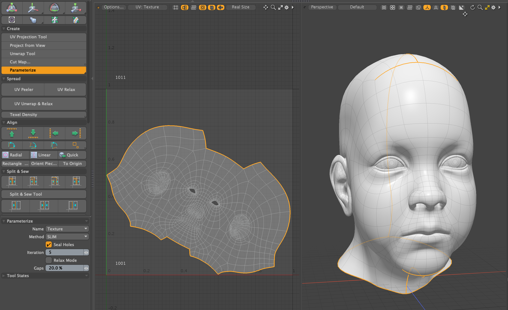

# Parameterize for Modo plug-in
This is a research project to compare various parameterizatino algorithms using [CGAL](https://cgal.org) and [libigl](https://libigl.github.io) libraries. This is implemented as Modo Plug-ins kit and it contains a tool plugin and a procedural mesh operator.

## Installing
- Download lpk from releases. Drag and drop into your Modo viewport. If you're upgrading, delete previous version.

## How to use the plugins
- The tool version of Skeleton can be launched from "Parameterize" button on UV tab of Modo ToolBar on left.
- The procedural mesh operator version is available on Mesh Operator viewport. That is categorized in Polygon tab.
<div align="left">

</div>

## Name
Texure map name to create UVs. If nothing is selected, it creates new Texture map named "Texture".

## How to specify seam edges
This plugin takes seam edges to unwrap from the current selected edges. If the current selection mode is not Edge or no edge is selected. It sees boundary edges as seam edges. When **Seal Holes** is enabled, it fills virtual triangle along boundary edges. You can use boundary edges as seam edges with **Seal Holes** by selecting the boundary edges.

## Method
This kit supports following parametarization methods. Most of the methods are implemented using the CGAL library. Slim is implemented using Libigl.

## BORDER (Fixed Border Surface Parameterizations)<br>
Fixed border surface parameterizations are characterized by having a constrained border in parameter space. The constrained border is defined by **Circle** or **Square**. It supports several derived parameterizers. <br><br>
<u>**Angle** (Discrete conformal map parameterizer):</u> <br>
Discrete conformal map parameterizer attempts to lower angle deformation by minimizing a discrete version of the Dirichlet energy. This minimizes angle distortion as possible. <br>
<u>**Area** (Discrete authalic parameterizer):</u> <br>
Discrete authalic parameterizer corresponds to a weak formulation of an area-preserving method, and in essence locally minimizes the area distortion. <br>
<u>**Smooth** (Mean value coordinates parameterizer):</u> <br>
Mean value coordinates parameterizer is in essence an approximation of the Discrete Conformal Map, with a guaranteed one-to-one mapping when the border is convex. Vertex coordinates are calculated as the average of adjacent vertices, resulting in a smooth result.  <br>
<u>**Fast** (Barycentric mapping parameterizer):</u> <br>
Barycentric mapping parameterizer is the most basic parameterization method, which guarantees one-to-one correspondence under convex boundary conditions. Performs weighted varicenter calculations

<div align="center">

</div>

## LSCM (Least Square Comformal Maps)<br>
The Least Squares Conformal Maps (LSCM) parameterization method corresponds to a conformal method with a free border (at least two vertices have to be constrained to obtain a unique solution), which allows further lowering of the angle distortion. A one-to-one mapping is not guaranteed by this method. The constrained two vertices are choosen from source mesh vertices based on given **Pinning Axis**.

<div align="center">

</div>

## ARAP (As Rigid As Possible Parameterization)<br>
The as-rigid-as-possible parameterization method is a shape-preserving method based on an iterative energy minimization process. Each step alternates a local optimization technique to find the best local mapping and a global stitching technique equivalent to the resolution of a linear system to guarantee that the parameterized mesh is a triangulation.

<div align="center">

</div>

## SLIM (Scalable Locally Injective Maps)<br>
The Scalable Locally Injective Maps algorithm allows to compute locally injective maps on massive datasets. The algorithm shares many similarities with ARAP, but uses a reweighting scheme to minimize arbitrary distortion energies, including those that prevent the introduction of flips. This method supports Relax mode which loads the current UV maps as initial UV values and outputs the relaxed results.

<div align="center">

</div>

## Dependencies

- LXSDK  
This kit requires Modo SDK (Modo 16.1v8 or later). Download and build LXSDK and set you LXSDK path to LXSDK_PATH in CMakeLists.txt in triagulate.
- libigl 2.5.0 (https://github.com/libigl/libigl)  
This also requires Igl library. Download libigl and set the include path to -DLIBIGL_PATH argument. libigl is header only library.
- CGAL library 6.0.1 (https://github.com/cgal/cgal)  
This also requires CGAL library. Download and CGAL from below and set the include and library path to CMakeLists.txt in triagulate.
- Boost 1.87.0 (https://www.boost.org/)
- GMP 6.3.0 (https://gmplib.org/)
- MPFR 4.2.1 (https://https://www.mpfr.org/)


## License
```
This software is based part on libigl : A simple c++ geometry processing library:
Copyright 2013 - Alec Jacobson, Daniele Panozzo, Olga Diamanti, Kenshi
Takayama, Leo Sacht, Interactive Geometry Lab - ETH Zurich
https://libigl.github.io
Licensed under the MPL-2.0 license.
```

```
This software is based part on CGAL (The Computational Geometry Algorithms Library):
Licensed under the GPL-3.0 license.
https://cgal.org
```
